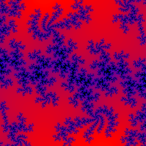
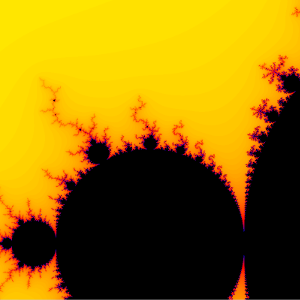

# FractalGenerator
Fractales, ensembles de Mandelbrot, ensembles de Julia, tout ça

<i>Ensemble de Julia
* z: (-0.55, 0.55)
* pos: (0., 0.)
* zoom: 10e5
* nbIter: 200
* precision: = 50.
* t: 2.36s
</i>

<i>Ensemble de Mandelbrot
* pos: (-1., -0.25)
* zoom: 10e2
* nbIter: 100
* precision: = 25.
* t: 0.89s
</i>
